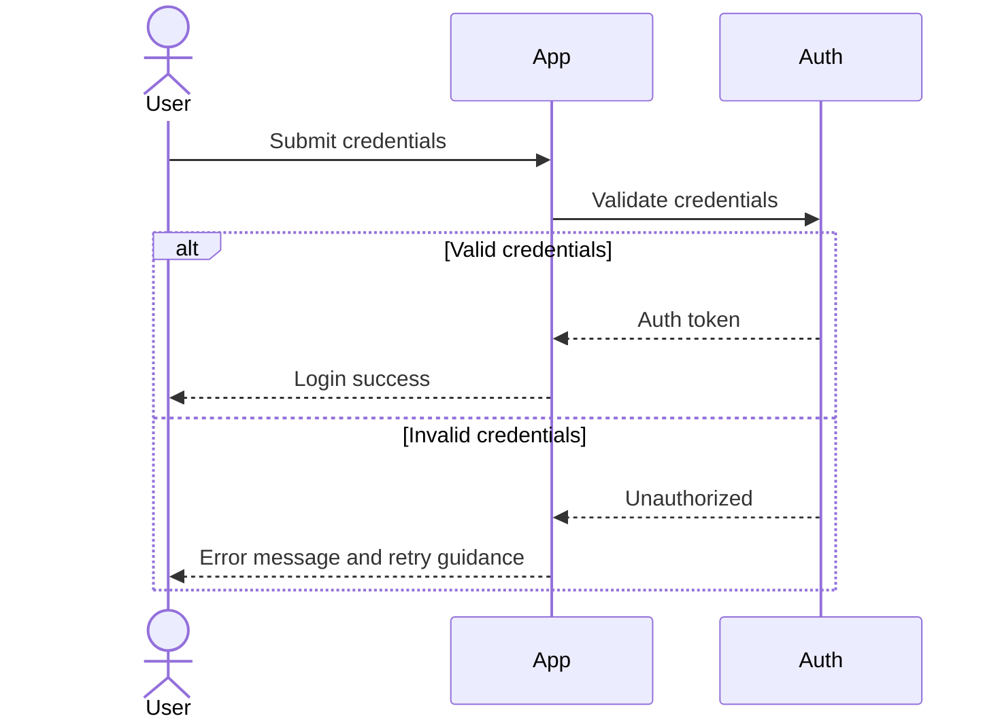

# AI Instructions And Quality Baseline

Use this before generating or modifying production code.

## Core Principles

- Specs first, code second
- Deterministic acceptance criteria
- Small, reversible changes
- Traceability from story -> spec -> code -> tests
- Security and privacy by default
- OWASP Top 10 checks for affected features before merge

## SDD Operating Modes

- Spec-first: write and approve the spec before asking AI to generate implementation.
- Spec-anchored: keep specs after delivery and continue maintenance through spec evolution.
- Spec-as-source: for suitable features, treat spec files as the long-term source and regenerate implementation from spec updates.

Guidance:
- Default to Spec-first + Spec-anchored for most teams.
- Use Spec-as-source where generation quality and test coverage are mature enough to safely support it.

## Engineering Quality Expectations

- Apply SOLID principles where they improve maintainability
- Prefer clean architecture boundaries over tightly coupled code
- Keep functions focused and composable
- Make dependencies explicit and testable
- Handle errors deliberately with useful diagnostics
- Avoid hidden side effects

## BA Expectations

- Write user stories with clear business value
- Include acceptance criteria that are measurable and binary
- Include constraints, assumptions, and edge cases
- Define non-functional requirements where relevant
- Define both happy-path and negative-path requirements per story
- Add Mermaid sequence diagrams for key workflows and failure branches
- Document alternate and exception flows explicitly

BA workflow modeling minimum:
- One end-to-end sequence diagram for each critical feature flow
- At least one failure/exception branch in each critical diagram
- Actor handoffs between user, system, and external services are shown

## Dev Expectations

- Implement strictly against accepted specs
- Add tests for happy paths and negative paths
- Cover integration boundaries and failure behavior
- Add observability: logs, metrics, and trace points where needed
- Refactor generated code before merge if structure is weak

Dev code quality checklist:
- SOLID: single responsibility, explicit interfaces, dependency inversion where it improves testability
- DRY: remove duplicated logic and centralize shared rules
- Clean Code: clear naming, small focused functions, minimal side effects
- Defensive boundaries: validate inputs and fail safely with actionable errors
- Maintainability: avoid speculative abstractions and dead code

## QA Expectations

- Derive tests directly from acceptance criteria
- Validate happy path, negative path, and edge conditions
- Include permission, validation, resilience, and regression tests
- Document reproducible defects with expected vs actual behavior
- Build an input matrix with expected outcomes for each critical scenario
- Include boundary values, invalid formats, null/empty inputs, and permission variants
- Use Playwright MCP and Chrome MCP for UI/e2e validation and browser-level diagnostics when relevant

QA validation minimum:
- Each acceptance criterion has at least one passing test and one failure/negative test where applicable
- Test artifacts include inputs, expected outcome, actual outcome, and evidence reference
- Critical paths include deterministic assertions, not only visual/manual checks

## Definition Of Ready

- Stories are clear and testable
- Dependencies and data contracts are known
- Risks are identified
- Test strategy is drafted

## Definition Of Done

- Code passes lint and tests
- Acceptance criteria are fully validated
- Negative and edge paths are covered
- Security and data handling checks are complete
- OWASP Top 10 review completed for affected surfaces
- Documentation and traceability are updated

## Practical Examples

Example 1: Spec-first in practice
- BA finalizes feature spec with measurable acceptance criteria.
- Dev generates scaffold only after spec approval.
- QA maps each criterion to a test case before merge.

Example 2: Spec-anchored maintenance
- A bug is found in discount logic.
- Team updates the spec rule first.
- Dev updates code and tests to match revised rule.

Example 3: Spec-as-source candidate
- Stable CRUD feature with strong generation templates.
- Human edits spec and regenerates module.
- Human focuses review on diffs and test evidence.

Example 4: BA workflow diagram with Mermaid
- Model login plus failed-auth branch for requirements clarity.

Example 5: QA input matrix sample
- Scenario: Create order endpoint
- Input A: valid payload -> Expected: 201 with order id
- Input B: missing required field -> Expected: 400 with field error
- Input C: unauthorized token -> Expected: 401/403 with no data mutation
